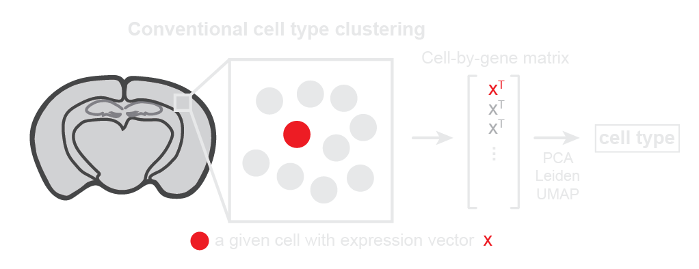
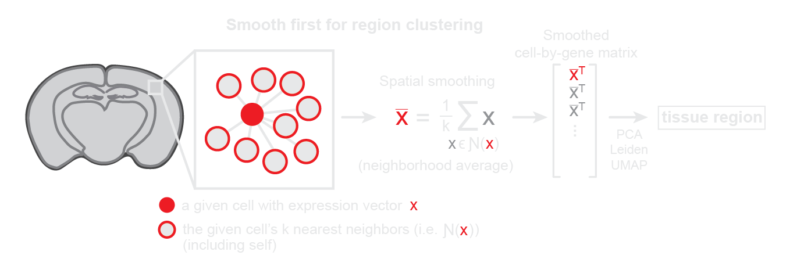
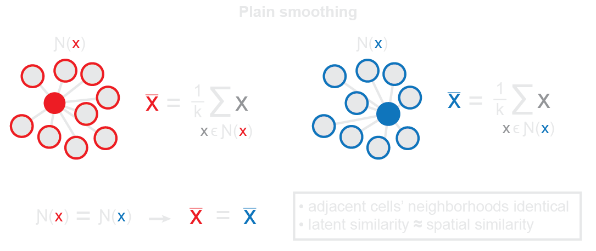
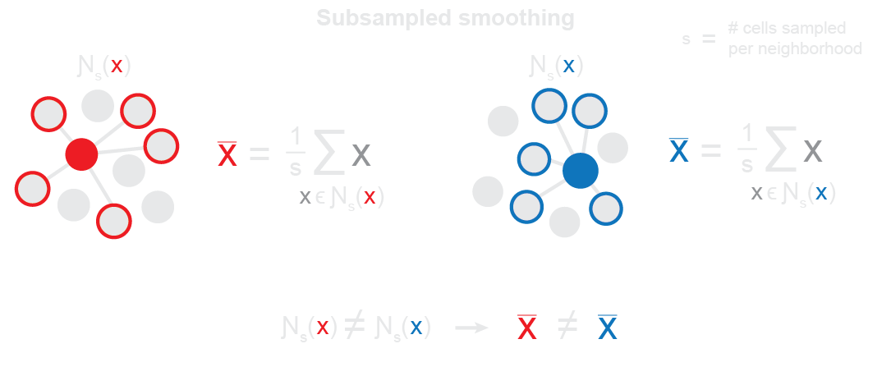

# SPIN: <ins>sp</ins>atial <ins>in</ins>tegration of spatially-resolved transcriptomics (SRT) data
[](https://doi.org/TEMP) ⬅️ read the preprint here <br>
[](https://doi.org/TEMP) ⬅️ access the data here <br>

SPIN is a lightweight, Scanpy-based implementation of the subsampling and smoothing approach described in the manuscript linked above. It enables the alignment and analysis of transcriptionally-defined tissue regions across multiple SRT datasets, regardless of morphology or experimental technology, using conventional single-cell tools. Here we include information regarding:

1. A conceptual overview of the approach
2. Package requirements
3. Installation instructions
4. Basic usage principles

For examples of downstream analysis (e.g. differentially-expressed gene analysis and trajectory inference), see the [tutorial](docs/tutorials/tutorial.ipynb) notebook. For further details on SPIN parameters, import SPIN into Python and run `help(spin)`.

## 1. Conceptual overview
* Conventional single-cell analysis can identify molecular *cell types* by considering each cell individually.
* However, it does not incorporate spatial information.
<picture>
   <source media="(prefers-color-scheme: light)" srcset="docs/imgs/github_idea_1_light.png">
   <source media="(prefers-color-scheme: dark)" srcset="docs/imgs/github_idea_1_dark.png">
   
</picture>

* Arguably the simplest way to incorporate spatial information and identify molecular *tissue regions* is to spatially smooth gene expression features across cells in the tissue.
* This can be done by setting the features of each cell to the average of its spatial neighborhood.
<picture>
   <source media="(prefers-color-scheme: light)" srcset="docs/imgs/github_idea_2_light.png">
   <source media="(prefers-color-scheme: dark)" srcset="docs/imgs/github_idea_2_dark.png">
   
</picture>

* However, a problem arises when smoothed representations of each cell are compared to one another.
* Physically adjacent cells will have almost identical neighborhoods and thus almost identical smoothed representations.
<picture>
   <source media="(prefers-color-scheme: light)" srcset="docs/imgs/github_obstacle_1_light.png">
   <source media="(prefers-color-scheme: dark)" srcset="docs/imgs/github_obstacle_1_dark.png">
   
</picture>

* Because conventional methods for downstream anlaysis rely on the nearest neighbors graph in feature space, we run into a problem: nearest neighbors in feature space are just nearest neighbors in physical space.
* This leads to reconstruction of physical space in latent space rather than identifying the desired large-scale molecular patterns.
* Here, we implement an approach in which each cell's spatial neighborhood is randomly subsampled before averaging, allowing the *exact neighborhood* composition to vary while still maintaining the *general molecular* composition.
<picture>
   <source media="(prefers-color-scheme: light)" srcset="docs/imgs/github_obstacle_2_light.png">
   <source media="(prefers-color-scheme: dark)" srcset="docs/imgs/github_obstacle_2_dark.png">
   
</picture>

Ultimately, this approach enables the application of conventional single-cell tools to spatial molecular features in SRT data, yielding regional analogies for each tool. For more details and examples, please refer to the manuscript and [tutorial](docs/tutorials/tutorial.ipynb).

## 2. Requirements:

### Software:
* Tested on MacOS (Monterey, Ventura) and Linux (Red Hat Enterprise Linux 7).
* The only dependency is Scanpy. For details, see [`pyproject.toml`](pyproject.toml).

### Data:
* One or more SRT datasets in `.h5ad` format
* An expression matrix under `.X` (both sparse and dense representations supported)
* Spatial coordinates under `.obsm` (can be specified with argument `spatial_key`)
* if multiple SRT datasets, batch labels stored under `.obs` (can be specified with argument `batch_key`)

## 3. Installation

### From GitHub:
```
pip install git+https://github.com/wanglab-broad/spin@main
```
Installation takes ~2 mins.

## 4. Usage
### In Python:
Consider the marmoset and mouse data we provide as a demo:
```python
adata = sc.read_h5ad(
    'data/demo.h5ad',
     backup_url='https://zenodo.org/record/TEMP/files/demo.h5ad?download=1'
)
```
This dataset contains expression and spatial data from marmoset and mouse brains, corresponding to the cell labels `'marmoset'` and `'mouse'` under the key `.obs['species']`.

To spatially integrate and cluster this data, the single dataset can be passed into `spin.integrate` while specifying the batch key, followed by `spin.cluster`:
```python
import spin

adata = spin.integrate(
    adata,
    batch_key='species',
    n_nbrs=30,
    n_samples=12,
)

adata = spin.cluster(
    adata,
    resolution=0.5
)
```

This performs the following steps:
* `spin.integrate`:
   1. Subsampling and smoothing of each dataset individually (stored under `adata.layers['smooth']`)
   2. Joint PCA across both smoothed datasets
   3. Integration of the resulting PCs using Harmony (stored under `adata.obsm['X_pca_spin']`)
* `spin.cluster`:
   1. Latent neighbor search
   2. Leiden clustering (stored under `adata.obs['region']`)
   3. UMAP (stored under `adata.obsm['X_umap_spin']`)

The resulting region clusters can then be visualized using standard Scanpy functions:
```python
# In physical space
sc.set_figure_params(figsize=(8,5))
sc.pl.embedding(adata, basis='spatial', color='region', s=7)

# In UMAP space
sc.set_figure_params(figsize=(5,5))
sc.pl.embedding(adata, basis='X_umap_spin', color='region', s=3)
```
Downstream analysis (e.g. DEG analysis, trajectory inference) can then be performed using standard Scanpy functions as well.
For details on downstream analysis, see the [tutorial](docs/tutorials/tutorial.ipynb).

Alternatively, for integration, one can provide multiple datasets with batch labels corresponding to each dataset:
```python
adata = spin.integrate(
    [adata_marmoset, adata_mouse],
    batch_key='species',
    batch_labels=['marmoset', 'mouse'],
    n_nbrs=30,
    n_samples=12,
)
```

... or a single dataset for finding regions in just one sample:
```python
adata = spin.integrate(
    adata_marmoset,
    n_nbrs=30,
    n_samples=12,
)
```
For further details on the parameters of `spin.integrate` and `spin.cluster`, import SPIN into Python and run `help(spin)`.

### From the shell:
Requires a read path to the relevant dataset(s) as well as a write path for the output dataset. Otherwise, provide the same parameters you would when running in Python (e.g. above):
```python
python spin/src/spin.py \
--adata_paths data/demo.h5ad \
--write_path data/demo_integrated.h5ad \
--batch_key species \
--batch_labels marmoset mouse \
--n_nbrs 30 \
--n_samples 12 \
--resolution "0.5"
```

Just as when running in Python, multiple datasets can be passed in instead:
```python
python spin/src/spin.py \
--adata_paths data/demo_marmoset.h5ad data/demo_mouse.h5ad \
--write_path data/demo_integrated.h5ad \
--batch_key species \
--batch_labels marmoset mouse \
--n_nbrs 30 \
--n_samples 12 \
--resolution "0.5"
```

... or just a single dataset:
```python
python spin/src/spin.py \
--adata_paths data/demo_marmoset.h5ad\
--write_path data/demo_integrated.h5ad \
--n_nbrs 30 \
--n_samples 12 \
--resolution "0.5"
```
