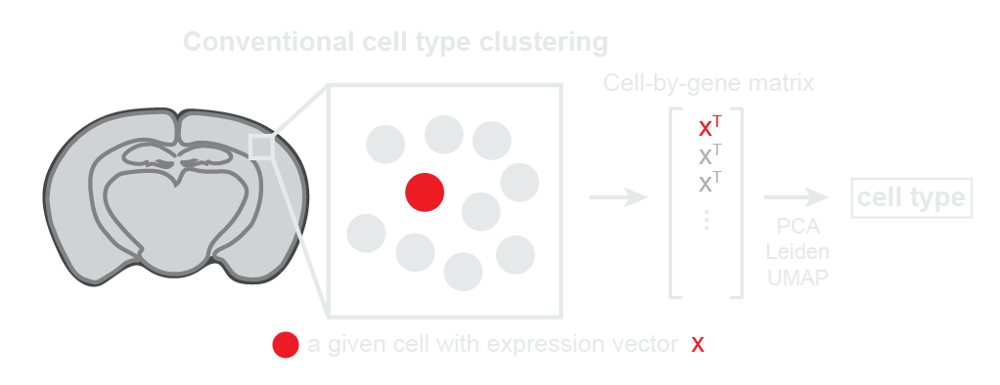
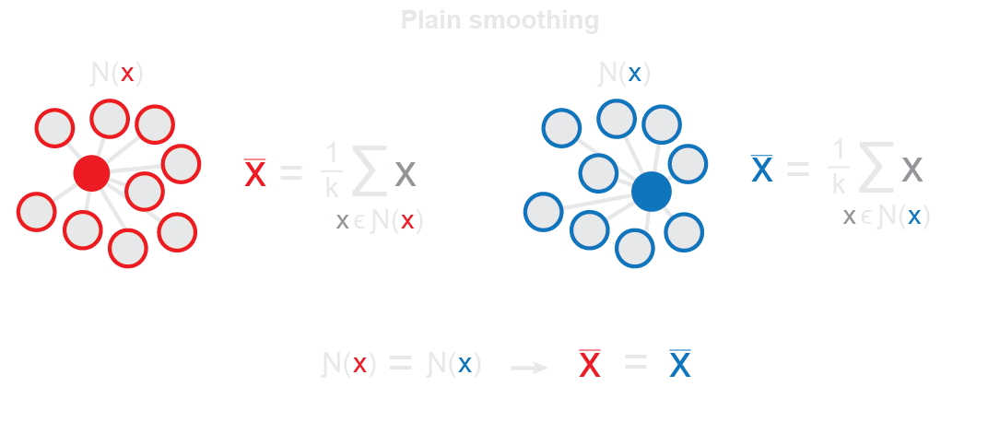

# SPIN: <ins>sp</ins>atial <ins>in</ins>tegration of spatially resolved transcriptomics (SRT) data
[](https://doi.org/10.1101/2023.06.30.547258) ⬅️ manuscript <br>
[](https://doi.org/10.5281/zenodo.13883268) ⬅️ data <br>

SPIN is a simple, Scanpy-based implementation of the subsampling and smoothing approach described in the manuscript *Mitigating autocorrelation during spatially resolved transcriptomics data analysis*. It enables the alignment and analysis of transcriptionally defined tissue regions across multiple SRT datasets, regardless of morphology or experimental technology, using conventional single-cell tools. Here we include information regarding:

1. A conceptual overview of the approach
2. Package requirements
3. Installation instructions
4. Basic usage principles

For examples of downstream analysis (e.g. differentially expressed gene analysis and trajectory inference), see the [tutorial](docs/tutorials/tutorial.ipynb) notebook. For further details on SPIN parameters, import SPIN into Python as shown below and run `help(spin)`.

## 1. Conceptual overview
* Conventional single-cell analysis can identify molecular *cell types* by considering each cell individually.
* However, it does not incorporate spatial information.
<picture>
   <source media="(prefers-color-scheme: light)" srcset="docs/imgs/github_idea_1_light.png">
   <source media="(prefers-color-scheme: dark)" srcset="docs/imgs/github_idea_1_dark.png">
   
</picture>

* Arguably the simplest way to incorporate spatial information and identify molecular *tissue regions* is to spatially smooth gene expression features across neighboring cells in the tissue.
* This can be done by setting the features of each cell to the average of its spatial neighborhood.
<picture>
   <source media="(prefers-color-scheme: light)" srcset="docs/imgs/github_idea_2_light.png">
   <source media="(prefers-color-scheme: dark)" srcset="docs/imgs/github_idea_2_dark.png">
   
</picture>

* However, a problem arises when smoothed representations of each cell are compared to one another.
* Physically adjacent cells will have almost identical neighborhoods and thus almost identical smoothed representations.
<picture>
   <source media="(prefers-color-scheme: light)" srcset="docs/imgs/github_obstacle_1_light.png">
   <source media="(prefers-color-scheme: dark)" srcset="docs/imgs/github_obstacle_1_dark.png">
   
</picture>

* Thus, we end up with nearest neighbors in feature space that are just nearest neighbors in physical space.
* Because conventional methods for downstream anlaysis rely on the nearest neighbors graph in feature space, this leads to reconstruction of physical space in latent space rather than representing the true underlying large scale molecular patterns.
* Here, we implement an approach in which each cell's spatial neighborhood is randomly subsampled before averaging, allowing the *exact neighborhood* composition to vary while still maintaining the *general molecular* composition.
<picture>
   <source media="(prefers-color-scheme: light)" srcset="docs/imgs/github_obstacle_2_light.png">
   <source media="(prefers-color-scheme: dark)" srcset="docs/imgs/github_obstacle_2_dark.png">
   
</picture>

Ultimately, this approach enables the application of conventional single-cell tools to spatial molecular features in SRT data, yielding regional analogies for each tool. For more details and examples, please refer to the manuscript and [tutorial](docs/tutorials/tutorial.ipynb).

## 2. Requirements:

### Software:
* Tested on MacOS (Monterey, Ventura) and Linux (Red Hat Enterprise Linux 7).
* Command Line Tools is required for `pip` installing this package from GitHub. While it comes standard on most machines, those without it may encounter an `xcrun: error` when following the installation instructions below. See [here](https://apple.stackexchange.com/questions/254380/why-am-i-getting-an-invalid-active-developer-path-when-attempting-to-use-git-a) for simple instructions on how to install it.
* Python >= 3.9
* The only dependency is Scanpy. For details, see [`pyproject.toml`](pyproject.toml).

### Data:
* One or more SRT datasets in `.h5ad` format
* An expression matrix under `.X` (both sparse and dense representations supported)
* Spatial coordinates under `.obsm` (key can be specified with argument `spatial_key`)
* Batch information
   * If multiple batches in single dataset, batch labels provided under column in `.obs` with column name `batch_key`.
   * If multiple batches in separate datasets, batch labels for each dataset provided as input.

## 3. Installation

### From GitHub:
```
pip install git+https://github.com/wanglab-broad/spin@main
```
Takes ~5 mins.

## 4. Usage
### In Python:
Consider the marmoset and mouse data from the manuscript which we provide as a demo:
```python
import scanpy as sc

adata_marmoset = sc.read(
    'data/marmoset.h5ad',
    backup_url='https://zenodo.org/record/8092024/files/marmoset.h5ad?download=1'
)
adata_mouse = sc.read(
    'data/mouse.h5ad',
    backup_url='https://zenodo.org/record/8092024/files/mouse.h5ad?download=1'
)
```

These datasets can be spatially integrated and clustered using `spin`. The `batch_key` argument corresponds to the name of a new column in `adata.obs` that stores the batch labels for each dataset. The `batch_labels` argument is a list of these batch labels in the same order as the input AnnDatas:
```python
from spin import spin

adata = spin(
    adatas=[adata_marmoset, adata_mouse],
    batch_key='species',
    batch_labels=['marmoset', 'mouse'],
    resolution=0.7
)
```
This performs the following steps:
* `integrate`:
   1. Subsampling and smoothing of each dataset individually (stored under `adata.layers['smooth']`)
   2. Joint PCA across both smoothed datasets
   3. Integration of the resulting PCs using Harmony (stored under `adata.obsm['X_pca_spin']`)
* `cluster`:
   1. Latent nearest neighbor search
   2. Leiden clustering with a resolution of 0.7 (stored under `adata.obs['region']`)
   3. UMAP (stored under `adata.obsm['X_umap_spin']`)

Note that `spin` can equivalently take as input a single AnnData containing multiple labeled batches. It can also take a single AnnData containing one batch for finding regions in a single dataset. For examples, see the [tutorial](docs/tutorials/tutorial.ipynb).


The resulting region clusters can then be visualized using standard Scanpy functions:
```python
# In physical space
sc.set_figure_params(figsize=(7,5))
sc.pl.embedding(adata, basis='spatial', color='region')

# In UMAP space
sc.set_figure_params(figsize=(4,4))
sc.pl.embedding(adata, basis='X_umap_spin', color='region')
```
Downstream analysis (e.g. DEG analysis, trajectory inference) can then be performed using standard Scanpy functions as well.
For examples of downstream analysis, see the [tutorial](docs/tutorials/tutorial.ipynb).
For further details on the parameters of `spin`, import SPIN into Python as shown above and run `help(spin)`.

### From the shell:
SPIN can be executed from the shell using the `spin` command as shown below (the path is identified automatically; see [`spin_cli`](src/spin/cli.py) and [`pyproject.toml`](pyproject.toml))

Shell submission requires a read path to the relevant dataset(s) as well as a write path for the output dataset. Otherwise, provide the same parameters you would when running in Python as above:
```python
spin \
--adata_paths data/marmoset.h5ad data/mouse.h5ad \
--write_path data/marmoset_mouse_spin.h5ad \
--batch_key species \
--batch_labels marmoset mouse \
--resolution "0.7"
```

Just as when running in Python, a single AnnData containing multiple batches can be passed in instead, as well as just a single dataset containing a single batch.
